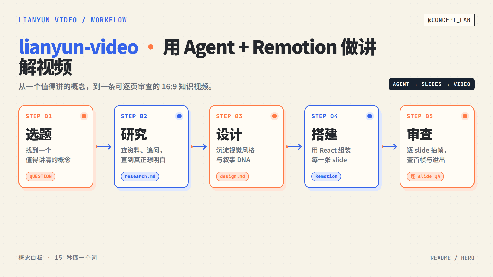
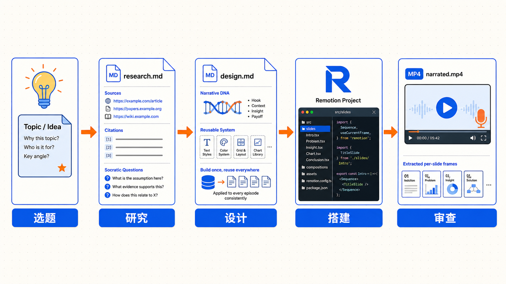
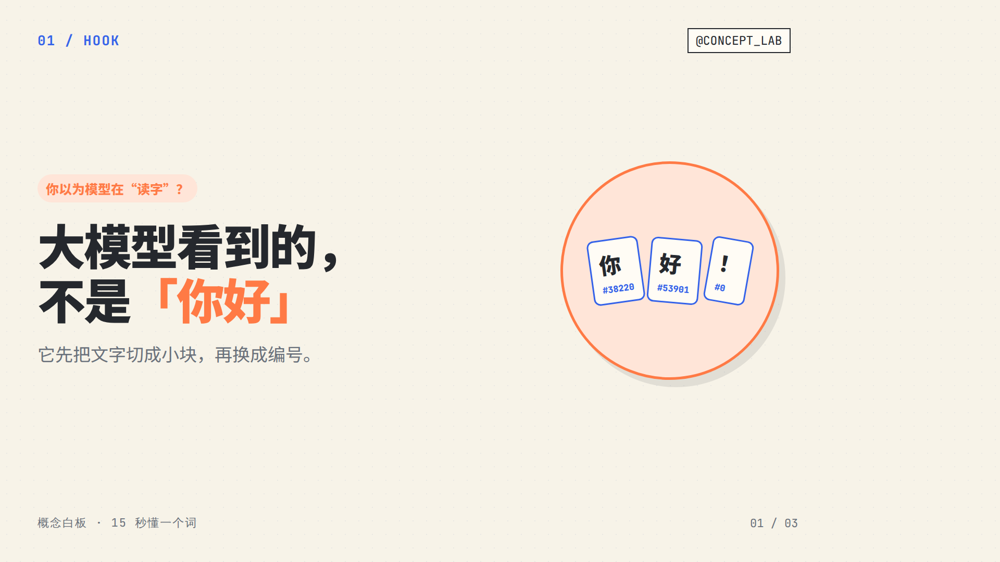
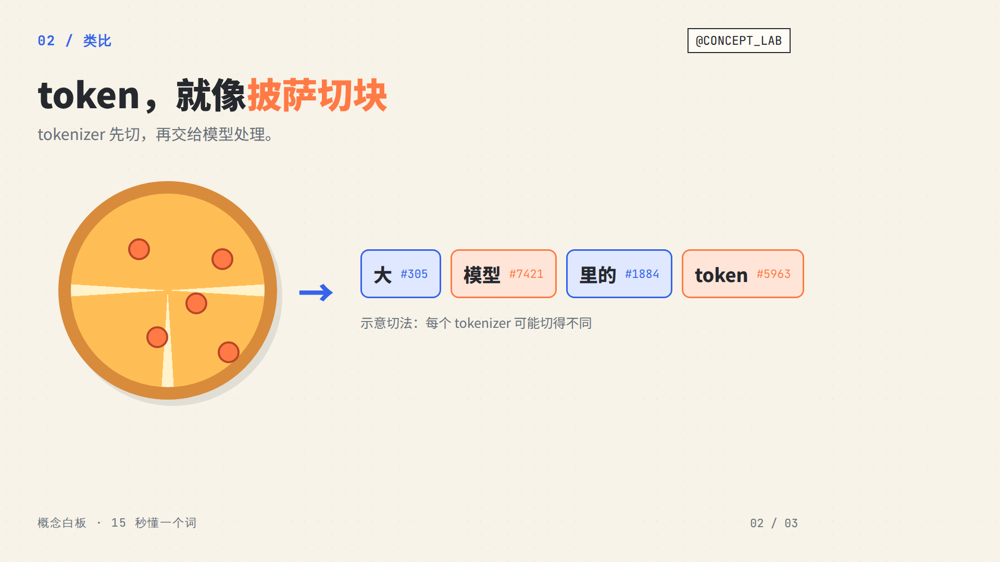
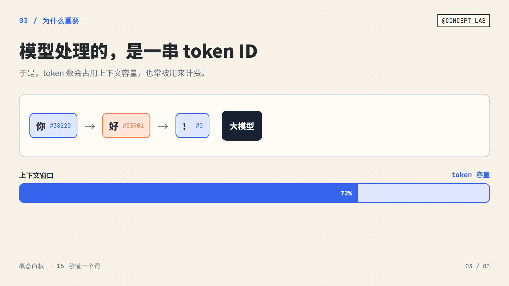

# lianyun-video-skill · 炼云视频

> 用 AI Agent + **Remotion** 做中文知识讲解类短视频的 packed skill。
> 给你的 Agent 装上它,从**选题 → 研究 → 写脚本 → 搭 Remotion 工程 → 渲染成片**,一条链路跑下来。



<p>
  
  
  
</p>

**适配**:Claude Code / Codex / 豆包 / Trae / 任何能读 `~/.claude/skills`、`~/.codex/skills`、`~/.agents/skills` 的 Agent。

---

## 这是什么

`lianyun-video-skill` 不是一个视频代码库,而是一组 **skill(工作流说明书)**。装上之后,你的 Agent 会**自己安装 Remotion、按你的设计系统搭 composition、把脚本渲染成视频**

## 解决什么问题

| 你现在 | 装上之后 |
|---|---|
| 想用 AI 做讲解视频,但不知道从哪起步 | Agent 读 skill 自己搭好 Remotion 工程 |
| 每条视频视觉都不一样,没辨识度 | 建一次 `design.md`,之后每条复用同一套视觉 DNA |
| 脚本一股 AI 腔、居高临下 | 内嵌「把观众当朋友」的写作硬标准 + `humanizer-zh` |
| 渲染出来才发现压字、溢出、封面空白 | 逐 slide 抽帧 QA 清单,提交前拦住 |

## 快速开始

**一键安装**(本 skill + 依赖的第三方 skill,全部装到全局 skills 目录):

```bash
bash <(curl -fsSL https://raw.githubusercontent.com/larry-xue/lianyun-video-skill/main/install.sh)
```

或克隆本仓库后跑 `bash install.sh`。装好后对你的 Agent 说:

```
用 lianyun-video 做一条讲「什么是 token」的讲解视频
```

Agent 会读入口 skill `lianyun-video`,按四步工作流往下走。

## 能力一览

| 你要做的事 | Skill |
|---|---|
| 入口 · 路由 + 四步工作流总览 | `lianyun-video` |
| 装 Remotion、搭工程、写 composition、渲染 | `lianyun-video-core` |
| 选题 → 研究 → 苏格拉底式对话 → 写脚本 | `lianyun-video-content` |
| 建你自己的 `design.md`、视觉与动画硬标准、QA | `lianyun-video-design` |

## 工作原理



## 配套第三方 skill(必需)

这套工作流依赖三个现成 skill——**引用,不搬运**,已在仓库根的 [`skills-lock.json`](./skills-lock.json) 里机器可读地声明:

- `remotion-best-practices`(`remotion-dev/skills`)—— Remotion 官方最佳实践
- `humanizer-zh`(`op7418/Humanizer-zh`)—— 中文去 AI 腔(脚本必过)
- `impeccable`(`pbakaus/impeccable`)—— 视觉打磨

> ⚠️ `skills add larry-xue/lianyun-video-skill` **只装本仓库这 4 个 skill,不会自动带上这 3 个依赖**。依赖要用下面任一方式单独装。

**装法(任选一)**:

```bash
# ① 全局一键(推荐)——本 skill + 3 个依赖一起装到全局
bash install.sh

# ② 项目级声明式恢复——在克隆下来的仓库目录内,从 skills-lock.json 恢复这 3 个依赖(装进当前项目,非全局)
npx skills experimental_install

# ③ 手动单独装到全局
npx -y skills add remotion-dev/skills -g -s remotion-best-practices -y
npx -y skills add op7418/Humanizer-zh -g --all
npx -y skills add pbakaus/impeccable -g --all
```

## 不包含什么(本版本)

- ❌ **配音(TTS)/ 字幕** —— slide 时长由脚本显式指定,不做音频对齐。后续可扩展。
- ❌ **自动发布** —— 渲出 MP4 后自己传平台。
- ❌ 任何账号绑定的私有内容 / 密钥。

## 项目结构

```
lianyun-video-skill/
├── skills/
│   ├── lianyun-video/            # 入口:能力地图 + 四步工作流
│   ├── lianyun-video-core/       # Remotion 基建 + composition 契约 + 模板
│   ├── lianyun-video-content/    # 选题 → 研究 → 脚本 + 写作硬标准
│   └── lianyun-video-design/     # design.md 模板 + 视觉/动画/QA reference
├── demo/                         # Agent 实跑产出的示例(见下)
├── skills-lock.json              # 声明第三方依赖(npx skills experimental_install)
├── install.sh                    # 全局一键安装(本 skill + 3 个依赖)
├── LICENSE                       # CC BY-NC 4.0
└── README.md
```

## Demo

下面这条「什么是 token」的讲解视频,是一个**完全没有上下文的 Agent(Codex)只读这套 skill、从零做出来的**

| Hook | 类比 | 为什么重要 |
|---|---|---|
|  |  |  |

完整成片:[`demo/token-explainer.mp4`](./demo/token-explainer.mp4);全套工程源码 + 复现步骤:[`demo/`](./demo/)。

## License

[CC BY-NC 4.0](./LICENSE)
